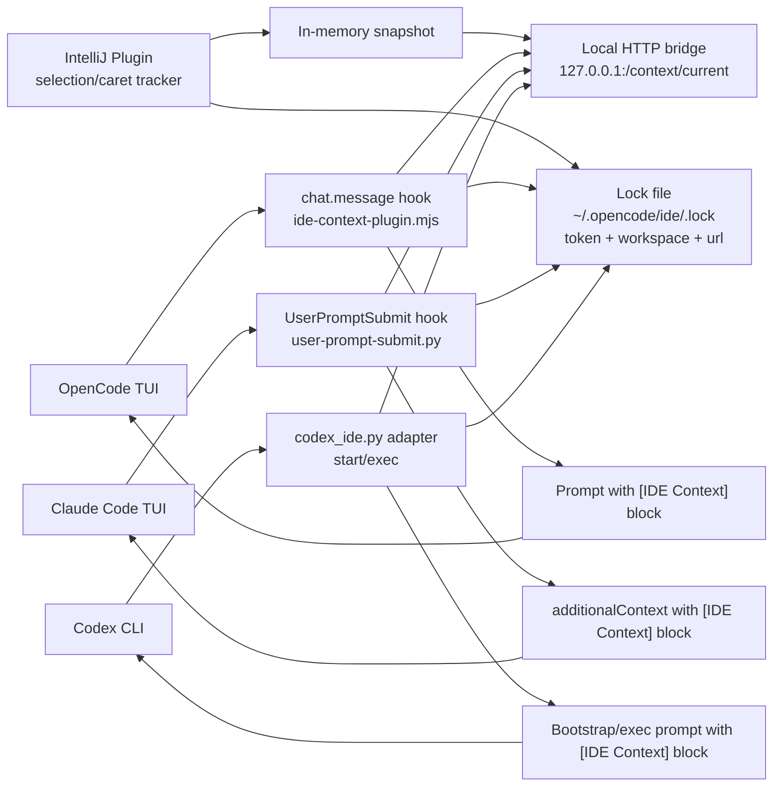

# IDE Context Injection Architecture

## Runtime sequence

1. IDE plugin captures selection or current class fallback.
1. IDE plugin refreshes lock file with auth token and local endpoint.
1. OpenCode plugin intercepts each outgoing user message (`chat.message`) and prepends context.
1. Claude plugin intercepts each submitted prompt (`UserPromptSubmit`) and returns context as `additionalContext`.
1. Codex adapter injects context for `exec` and first interactive bootstrap prompt.
